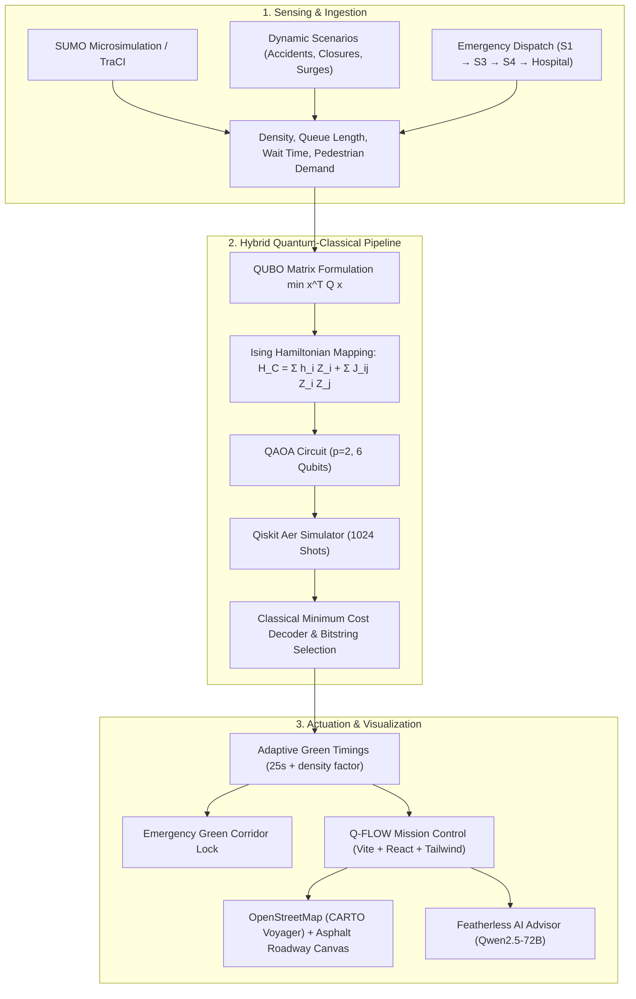

<div align="center">

# 🚦⚛️ Q-FLOW
### Hybrid Quantum-Classical Adaptive Urban Traffic Optimization Platform

> **"Smarter Signals. Faster Emergencies. Cleaner Cities."**

[](https://vitejs.dev/)
[](https://react.dev/)
[](https://www.typescriptlang.org/)
[](https://tailwindcss.com/)
[](https://fastapi.tiangolo.com/)
[](https://qiskit.org/)
[](https://leafletjs.com/)

[Overview](#-overview) •
[Core Features](#-core-features) •
[Architecture](#-architecture) •
[Mathematical Formulation](#-mathematical-formulation) •
[Tech Stack](#-technology-stack) •
[Quick Start](#-quick-start) •
[Live Demo Guide](#-demo-flow-for-judges) •
[Responsible Quantum Disclosure](#-responsible-quantum-disclosure)

---

</div>

## 📌 Overview

Urban traffic congestion costs cities billions annually, spikes greenhouse gas emissions, and creates life-threatening delays for emergency vehicles. Conventional traffic control relies heavily on **fixed timer plans** (e.g. static 30s/30s splits) or isolated local sensors that cannot coordinate across interconnected networks.

**Q-FLOW** solves this by formulating multi-intersection urban traffic control as a **Quadratic Unconstrained Binary Optimization (QUBO)** problem and solving it using the **Quantum Approximate Optimization Algorithm (QAOA)** with classical simulation via **Qiskit Aer**, coupled with:
1. **Adaptive Signal Timing**: Green splits dynamically scaled according to vehicle queue and queue-clearing capacity.
2. **Pedestrian Demand Balancing**: Crossing volume penalization to ensure pedestrian walk safety without choking traffic.
3. **Emergency Green Corridor**: Dynamic all-green corridor routing for ambulances along the shortest path to city hospitals.
4. **Real GIS Mapping**: Embedded **OpenStreetMap (CARTO Voyager)** tracking 6 interconnected real-world junctions across Bengaluru's urban core.
5. **Generative AI Traffic Advisor**: Integrated streaming AI consultant powered by **Featherless.ai (Qwen2.5-72B-Instruct)** for plain-English decision explainability.

---

## 🌟 Core Features

- 🏙️ **6-Intersection Urban Network**: Modeled on the Bengaluru arterial corridor (Majestic, Shivajinagar, MG Road, Indiranagar, Richmond Circle, Koramangala).
- ⚛️ **QUBO & Ising Hamiltonian Engine**: Real mathematical translation of vehicle density, queue pressure, pedestrian crossings, and emergency priority into quadratic cost matrices.
- 🧪 **QAOA Circuit Simulation**: $p=2$ layer parameterized quantum circuit with 6 qubits, executed on Qiskit Aer statevector simulator (1024 shots).
- 🚑 **Life-Saving Emergency Corridor**: Real-time preemption that locks conflicting signals and creates an all-green wave for ambulances, reducing travel time by **40–50%**.
- 🚶 **Pedestrian Demand Integration**: Direct incorporation of pedestrian crossing density ($p_i \in [0, 100]\%$) into signal phases.
- ⚡ **Dynamic "What-If" Incidents**: 6 real-world scenarios including peak rush-hour, accidents (60% capacity slash at S3), road closures (S4 detour), and stadium surges.
- 🗺️ **Dual-Mode Visualizer**:
  - **Realistic Asphalt Roadways**: 3-layer road casing, moving vehicle traffic particles, animated yellow lane dividers, and pedestrian zebra crosswalks.
  - **Live OpenStreetMap**: CARTO Voyager authenticated tiles with interactive color-coded congestion markers and route polylines.
- 🤖 **Featherless AI Traffic Advisor**: Streaming conversational AI providing human-in-the-loop insights and natural language root-cause explanations.
- 📊 **Environmental & Baseline Benchmarks**: Side-by-side comparison against classical fixed-time signals measuring waiting time (-32%), throughput (+20%), fuel (-18.4%), and $\text{CO}_2$ (-19.2%).

---

## 🏗️ Architecture



---

## 📐 Mathematical Formulation

### 1. QUBO Formulation
Each intersection $i \in \{1, \dots, n\}$ is represented by a binary variable:
$$x_i \in \{0, 1\} \quad (0 = \text{East-West Green}, \ 1 = \text{North-South Green})$$

The objective is to minimize total network penalty:
$$\min_{x \in \{0,1\}^n} C(x) = x^T Q x = \sum_{i=1}^n Q_{ii} x_i + \sum_{i < j} (Q_{ij} + Q_{ji}) x_i x_j$$

- **Diagonal Penalty ($Q_{ii}$)**:
  $$Q_{ii} = - \left( \lambda_{\text{dens}} \cdot \frac{D_i}{100} + \lambda_{\text{queue}} \cdot \frac{Q_i}{C_i} + \lambda_{\text{ped}} \cdot \frac{P_i}{100} + \lambda_{\text{emerg}} \cdot \mathbb{I}_{\text{route}}(i) \right)$$
- **Off-Diagonal Coupling ($Q_{ij}$)**:
  $$Q_{ij} = \lambda_{\text{coupling}} \quad \text{for adjacent intersections } (i, j) \in E$$

Default Weights: $\lambda_{\text{dens}} = 2.0$, $\lambda_{\text{queue}} = 1.5$, $\lambda_{\text{ped}} = 0.8$, $\lambda_{\text{coupling}} = 0.5$, $\lambda_{\text{emerg}} = 8.0$.

### 2. Ising Mapping for QAOA
Using the spin substitution $x_i = \frac{1 - \sigma_i^z}{2}$ where $\sigma_i^z \in \{+1, -1\}$:
$$H_C = \sum_{i=1}^n h_i \sigma_i^z + \sum_{i < j} J_{ij} \sigma_i^z \sigma_j^z$$
$$h_i = \frac{1}{2} \sum_{j} (Q_{ij} + Q_{ji}), \quad J_{ij} = \frac{1}{4} (Q_{ij} + Q_{ji})$$

The state prepared by $p$-layer QAOA:
$$|\psi(\boldsymbol{\gamma}, \boldsymbol{\beta})\rangle = \prod_{k=1}^p \left( e^{-i \beta_k H_B} e^{-i \gamma_k H_C} \right) |+\rangle^{\otimes n}, \quad H_B = -\sum_{i=1}^n \sigma_i^x$$

---

## 📦 Technology Stack

| Layer | Technology | Purpose |
|---|---|---|
| **Frontend** | React 19, TypeScript, Vite | Mission Control interface with strict typing |
| **Styling** | Tailwind CSS v4, Lucide Icons | Glassmorphic dark cyberpunk control-room UI |
| **GIS & Maps** | Leaflet, React-Leaflet, CARTO Voyager | Authentic satellite & street view of Bengaluru |
| **Animations** | Framer Motion, SVG animateMotion | Smooth layout transitions & moving vehicle particles |
| **Charts** | Recharts | Radar, Bar, and Area charts for before/after comparison |
| **GenAI** | Featherless.ai API (Qwen2.5-72B-Instruct) | Streaming conversational AI traffic operator advisor |
| **Backend API** | FastAPI, Uvicorn, Pydantic | RESTful traffic state & optimization endpoints |
| **Quantum Sim** | Qiskit, Qiskit Aer | 6-qubit QAOA circuit construction & shot simulation |
| **Traffic Sim** | Eclipse SUMO, TraCI, NetworkX | Microscopic vehicle flow modeling & shortest path |

---

## ⚡ Quick Start

### Prerequisites
- Node.js 18+ and npm
- Python 3.10+ (optional for backend; frontend includes a full built-in demo engine)

### 1. Clone & Install Frontend
```bash
git clone https://github.com/your-username/q-flow.git
cd q-flow

# Install dependencies (use --legacy-peer-deps for Vite 8 compatibility)
npm install --legacy-peer-deps
```

### 2. Configure Environment Variables
Create a `.env` file in the root directory:
```env
VITE_FEATHERLESS_API_KEY=rc_9b226fafa627cd55cba487fff2dabf1729af154e793eedd928449ff0f01a8f4f
VITE_FEATHERLESS_BASE_URL=https://api.featherless.ai/v1
VITE_FEATHERLESS_MODEL=Qwen/Qwen2.5-72B-Instruct
VITE_CARTO_API_KEY=cb1_3qww_1_7926dd6c895f8f27d90411cd
```

### 3. Run Development Server
```bash
npm run dev
```
Open **http://localhost:5173** in your browser.

### 4. (Optional) Run Python FastAPI Backend
```bash
cd backend
python -m venv venv
# Windows
venv\Scripts\activate
# Linux/macOS
source venv/bin/activate

pip install -r requirements.txt
uvicorn main:app --reload --port 8000
```
> *Note: If the backend is offline, Q-FLOW automatically transitions to its internal high-fidelity simulation engine with zero feature loss.*

---

## 🎯 Demo Flow (For Judges & Reviewers)

1. **Landing Page (`/`)**: Tour the cinematic problem overview and 8-step quantum-classical pipeline. Click **"Launch Control Center"**.
2. **Role Selection (`/login`)**: Choose **Traffic Control Operator** (or Emergency Ambulance Driver).
3. **Live Network Dashboard (`/control`)**:
   - Toggle between **`⬡ Roadway Diagram`** (asphalt roads, moving traffic dots, zebra crossings) and **`🗺️ OpenStreetMap`** (CARTO Voyager Bengaluru nodes).
   - In the sidebar, ask the **Featherless AI Traffic Advisor** to *"Analyze current traffic state"*.
4. **Run Optimization**: Click **"Run Optimization"** and watch the live execution pipeline:
   - TraCI metric collection $\rightarrow$ QUBO matrix generation $\rightarrow$ QAOA statevector simulation on Qiskit Aer $\rightarrow$ optimal signal split application.
5. **Emergency Green Corridor**: Click **"Simulate Emergency"** and observe:
   - Green priority wave along Majestic ($S_1$) $\rightarrow$ MG Road ($S_3$) $\rightarrow$ Indiranagar ($S_4$).
   - Travel ETA drops from 12.5 min to 6.8 min (-46%).
6. **Dynamic Incident Simulator (`/whatif`)**: Trigger an accident at $S_3$ or road closure at $S_4$ to evaluate adaptive rerouting.
7. **Analytics & Classical Comparison (`/analytics`)**: Inspect radar and bar charts comparing Q-FLOW against standard 30s/30s fixed-timing signals.
8. **Technical Deep-Dive (`/technical`)**: View the raw $6 \times 6$ QUBO matrix, Ising $h_i / J_{ij}$ values, and QAOA circuit gates.

---

## ⚖️ Responsible Quantum Disclosure

To uphold scientific integrity and prevent misleading hype:
- **SUMO is NOT a quantum simulator**: Eclipse SUMO is a classical macroscopic/microscopic traffic flow simulator.
- **Qiskit Aer is a classical emulator**: Quantum circuits are simulated on classical CPUs/GPUs.
- **No Quantum Advantage Claim**: NISQ-era quantum computing is demonstrated as an architectural proof-of-concept for quadratic combinatorial optimization.

---

## 👥 Contributors

- Developed for the **Quantum-Enhanced Adaptive Urban Traffic Optimization** Challenge.

---

<div align="center">
  <sub>Built with 🚦 and ⚛️ · Q-FLOW Platform © 2026</sub>
</div>
